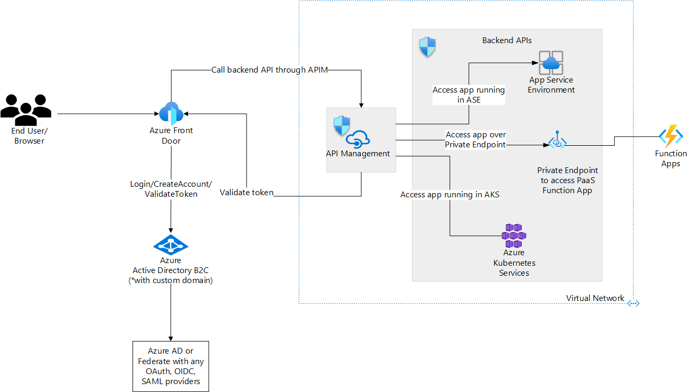

> The H1 title is a noun phrase that describes the scenario. Don't enter it here, but as the **name** value in the corresponding YML file.> 
> Include the solution idea header note at the top of the solution idea. This adds clarification why this is a scaled-back architecture (and provides consistency with our other SIs)...

[!INCLUDE [header_file](../../../includes/sol-idea-header.md)]

> Introductory section (no heading)
> The introduction contains:

- A paragraph that describes what the solution does (the domain)
- A paragraph that contains a brief description of the main Azure services that make up the solution. This paragraph should convey the Azure value proposition, not a complete description of the architecture.

Draft:
As applications and end users interact with backend APIs there is a greater need to protect these backend APIs against malicious users, and/or known users who do not have the right level of permissions to access specific APIs. To protect against unknown users, a token based authentication mechanism is generally considered as a good practice. 

This article talks about a solution to protect backend APIs using Azure API Management, Azure Active Directory B2C, and Azure Front Door.

## Potential use cases

> Are there any other use cases or industries where this would be a fit?
> How similar or different are they to what's in this article?

Draft:
- Prevent unauthenticated users from accessing backend APIs
- Prevent unauthorized users from accessing backend APIs
- Use Azure AD B2C for Federated Authentication with any OAuth, OIDC and SAML providers including 3rd parties such as Ping Identity, CA Siteminder etc.
- Prevent unintended load on APIs by making use of API Management features such as Throttling, Rate-Limiting, Ip-Filtering.
- Implement end user authentication using Azure Active Directory B2C

## Architecture

_Architecture diagram goes here_

> Under the architecture diagram, include this sentence and a link to the Visio file or the PowerPoint file: 

_Download a [Visio file](https://arch-center.azureedge.net/[filename].vsdx) of this architecture._

### Workflow

> An alternate title for this sub-section is "Workflow" (if data isn't really involved).
> In this section, include a numbered list that annotates/describes the dataflow or workflow through the solution. Explain what each step does. Start from the user or external data source, and then follow the flow through the rest of the solution (as shown in the diagram).

1. End User authenticates into an application by providing their credentials such as username and password. The user identity in this case is expected to be either in Azure AD B2C or in a third party identity provider.
    1. The authentication request goes through Azure Front Door and authenticates against Azure AD B2C configured with a custom domain. Azure AD B2C authenticates the user and returns a bearer token (JWT) back to the user.
    2. Optionally, if the user credentials are stored in a third party Identity Management Solution, Azure AD B2C federates with the respective system and returns a bearer token back to the user.
2. User triggers an event that accesses a backend API. This event could be a click of a button on a web application, or a direct call to the backend API's endpoint.
3. Request goes through Azure Front Door whose backend is mapped to public endpoint of Azure API Management. Azure API Management intercepts the request, and validates the bearer token against Azure Active Directory B2C. This can be implemented on Azure API Management using the the OAuth2 metadata endpoint that's configured as part of it's <validate-jwt /> policy.
4. If the token is valid, Azure API Management forwards the request to the appropriate backend API. Otherwise, the request is rejected.

### Components

> A bullet list of components in the architecture (including all relevant Azure services) with links to the product service pages. This is for lead generation (what business, marketing, and PG want). It helps drive revenue.

> Why is each component there?
> What does it do and why was it necessary?

TODO: 
* Azure API Management acts as an API Gateway for all backend APIs. It validates the incoming JWT token. 
* Azure Active Directory B2C (Azure AD B2C) provides Identity as a Service for Business to Customer Scenarios. In this scenario, Azure AD B2C is the Identity store for end user identity and returns the bearer token (JWT) on successful authentication. It's also the token store that API Management calls into to validate the token
* Azure Front Door provides layer 7 load balancing capabilities. It is needed to interact with Azure AD B2C over a custom domain.
* Azure App Service Environment 
* Azure Kubernetes Service
* Azure Functions

## Next steps

> Links to articles on Docs and Learn. Could also be to appropriate sources outside of Docs, such as third-party documentation, GitHub repos, or an official technical blog post.

Examples:
* [Azure Kubernetes Service (AKS) documentation](/azure/aks)
* [Azure Machine Learning documentation](/azure/machine-learning)
* [What are Azure Cognitive Services?](/azure/cognitive-services/what-are-cognitive-services)

## Related resources

> Use "Related resources" for related architecture guides and architectures (content on the Azure Architecture Center).

> Here are example sections:

Related architecture guides:

* [Artificial intelligence (AI) - Architectural overview](/azure/architecture/data-guide/big-data/ai-overview)
* [Choosing a Microsoft cognitive services technology](/azure/architecture/data-guide/technology-choices/cognitive-services)

Fully deployable architectures:

* [Chatbot for hotel reservations](/azure/architecture/example-scenario/ai/commerce-chatbot)
* [Build an enterprise-grade conversational bot](/azure/architecture/reference-architectures/ai/conversational-bot)
* [Speech-to-text conversion](/azure/architecture/reference-architectures/ai/speech-ai-ingestion)